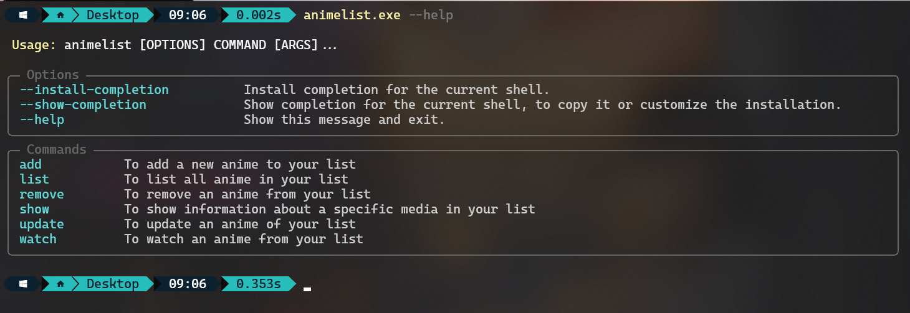

# MyAnimeList

[italiano](README.it.md)

MyAnimeList is a simple Command-line application that helps you keep track of the anime, films and manga you have
watched, are watching, or plan to watch. It allows you to manage your anime list from the comfort of the command line.

## Features

- List all anime
- Filter the list by genre, status, and rating
- Show information about a specific anime
- Add new anime to your list
- Remove anime from your list
- Update information about existing anime
- ...

## Usage

- **List:** To list all anime in your list
    - Options:
        - **--genre [genre]:** To filter your list by genre
        - **--status [status]:** To filter your list by status
        - **--rating [format]:** To filter your list by rating
            - **format:** [min]:[max] (1:10, [min]: -> >=min, :[max] -> <=max)
        - **--number [number]:** To limit the number of anime in the list
    - **Example:**
        - ./myanimelist list --genre action --status watching --rating 1:9

- **Show [name]:** To show information about a specific anime in your list
    - **Example:**
        - ./myanimelist show Attack on Titan
        - ./myanimelist show attack o

- **Add [name]:** To add a new anime to your list
    - Options (all parameters are optional):
        - **--genre:** Treat the provided arguments as genre
    - **Example:**
        - ./myanimelist add Attack On Titan
        - ./myanimelist add --genre action

- **Remove [name]:** To remove an anime from your list
    - Options (all parameters are optional):
        - **--genre:** Treat the provided arguments as genre
    - **Example:**
        - ./myanimelist remove Attack on Titan
        - ./myanimelist remove --genre action

- **Update [name]:** To update an anime of your list
    - Options (all parameters are optional, but at least one parameter needs to be provided):
        - **--type [type]:** a new type
            - **type:** Anime (default), Manga, Film
        - **--name [name]:** a new name
        - **--genre [genre]:** a new genre
        - **--season [season]:** a new season
        - **--episode [episode]:** a new episode
        - **--status [status]:** a new status
        - **--rating [rating]:** a new rating
    - **Example:**
        - ./myanimelist update --type film

- **Watch [name] [number of episode (default=1)]:** To watch anime (increase the number of anime episodes)
    - **Example:**
        - ./myanimelist watch Attack On Titan -e 2

## Installation

#### download via python pip

## License

MyAnimeList is released under the MIT License.
